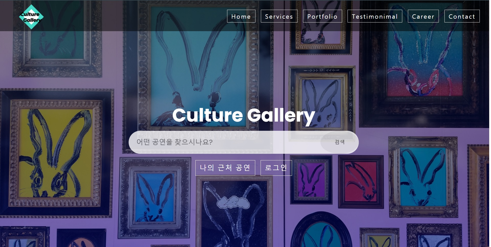

# Culture Gallery

## 사이트 주소
https://culturegallery.herokuapp.com/
## ✔ 목차
- [✔ 목차](#-목차)
- [소개](#-소개)
  - [개발 환경](#개발-환경)
  - [사용한 API](#사용한-api)
- [설치 방법](#-설치-방법)
  - [요구 사항](#요구-사항)
  - [설치](#설치)
- [사용 방법](#-사용-방법)
- [연락처](#-연락처)
- [개선 필요 내용](#-개선 필요 내용 )

## 소개


한국에서 진행하는 공연 중 본인에게 맞는 공연을 찾을 수 있는 서버입니다.<br>
본인 현재 위치 기반으로 주변에서 진행 하고있는 /진행 될 공연의 정보를 카카오 맵으로 제공합니다.<br>
기간/위치/비용 등의 필터를 통해 본인이 원하는 공연을 검색할 수 있습니다.<br>
카카오 계정 로그인을 통해 보러 가고 싶은 공연을 카카오톡 친구와 공유할 수 있는 기능을 제공합니다.

### 개발 환경
* [node.js - 14.15.1 LTS](https://nodejs.org/ko/)
* [Express - 4.17.1](https://expressjs.com/ko/)
* HTML5
* CSS3

### 사용한 API
* [Kakaomap Maps API](https://apis.map.kakao.com/)
  * [Document](https://apis.map.kakao.com/web/documentation/)
* [Kakao Login API](https://developers.kakao.com/docs/latest/ko/kakaologin/common/)
  * [Document](https://developers.kakao.com/docs/latest/ko/kakaologin/common)


## 설치 방법
서버 설치 방법을 소개합니다. 이 방법은 Local에서만 동작합니다.
### 요구 사항
* node.js 
   
이 [링크](https://nodejs.org/ko/)에서 설치할 수 있습니다.
* npm  

node.js와 함께 설치됩니다.  
혹은 가장 최신 버전으로 업데이트합니다.
```sh
npm install -g npm
```
### 설치
1. [리포지토리](http://khuhub.khu.ac.kr/2019102210/CultureGallery) 클론  
  원하는 디렉토리에서 아래의 명령어를 입력해 이 리포지토리를 가져옵니다.
  ```
  git clone http://khuhub.khu.ac.kr/2019102210/CultureGallery.git
  ```
2. npm 패키지 설치  
  서버 실행에 필요한 패키지를 설치합니다.
  ```
  npm install
  ```
3. 포트 변경  
  본 웹서비스는 local 환경에서 23023 번 포트를 할당받아 실행됩니다.
  23023번 포트에서 실행되고 있는 다른 프로그램 혹은 웹서비스와 동시에 실행될 수 없습니다.

4. 서버 구동  
  터미널에서 본 프로젝트의 디렉토리로 이동한 후 npm start를 실행합니다.
  ```
  npm start
  ```  

## 사용 방법
1. 본 페이지에서 다운받아 실행하는 경우, IE 8 이상의 웹 브라우저로 localhost:23023에 접속합니다. 
<br>

2. 나의 근처 공연/ 로그인 버튼/ 검색 버튼 중 하나를 선택합니다.<br>
* 기능 1. 나의 근처 공연<br>
  본인의 위치를 받아올 수 있도록 위치 수집 권한을 허락해주세요.<br>
  권한 허용 후 새로고침하면 지도 중심에 본인의 위치가 표시되고 주변의 공연 장소에 마크가 달립니다.<br>
  마크에 마우스를 올려놓으면 해당 공연의 id와 공연 이름이 검색됩니다.<br>
  주변 공연 장소는 지도 아래에 표로 자동 생성됩니다. 이 곳에서 정보를 확인하시고 전송하기 기능을 사용할 수 있습니다.<br>
  전송하기 기능은 카카오톡으로 접근되며, 접근을 위해서는 추가적인 권한 허용이 요구될 수 있습니다.

* 기능 2. 로그인<br>
  카카오톡 계정 로그인을 통해 더 많은 기능을 사용해보세요!<br>
  로그인을 하면 보러 가고 싶은 공연의 정보를 카카오톡 친구와 공유할 수 있습니다.<br>

* 기능 3. 검색하기<br>
  메인화면에서 검색버튼을 눌러주세요<br>
  검색 페이지로 넘어가면 찾고자 하는 공연의 이름을 적어주세요.<br>
  결과로 공연 이름에 입력 정보를 포함하는 공연들의 표가 나옵니다.<br>

## 개선 필요 내용
* db 내용 검색 기능 개선 필요.<br>
* 비동기식 코드 동기식으로 변경 필요<br>
* 검색하기 페이지에서 여러번 검색시 테이블 초기화 필요<br>


## 연락처
이유제: dbwp031@khu.ac.kr<br>
송효섭: crad_on25@khu.ac.kr<br>